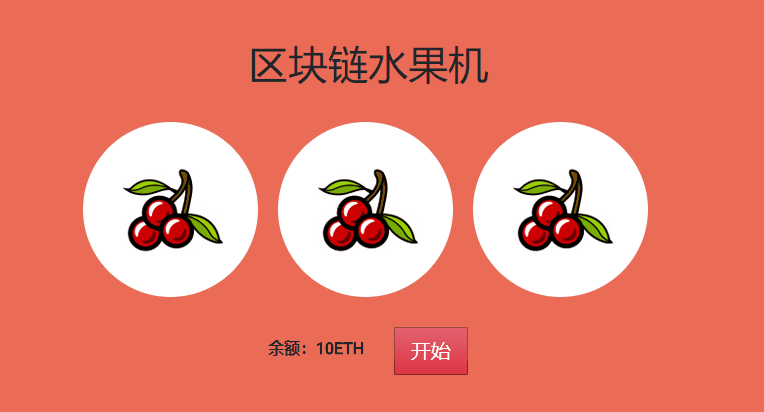

# ethereum-slot-machine
基于以太坊的水果机游戏

# 规则
- 初始化账号有10个ETH
- 每次游戏输了会减1个ETH，赢了则加2个ETH
- 注：有两个相同则不扣不增

# 效果

# 机器环境
- win10
- nodev8.9.4

# 安装依赖
- npm install -g truffle
- npm install -g ganache-cli

# 项目的运行
- （1）迁移合约：truffle migrate
- （2）启动ganache-cli：ganache-cli
- （3）修改app/index.html中的abi，和合约地址
